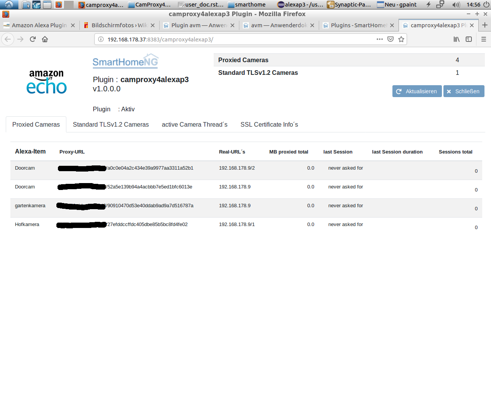
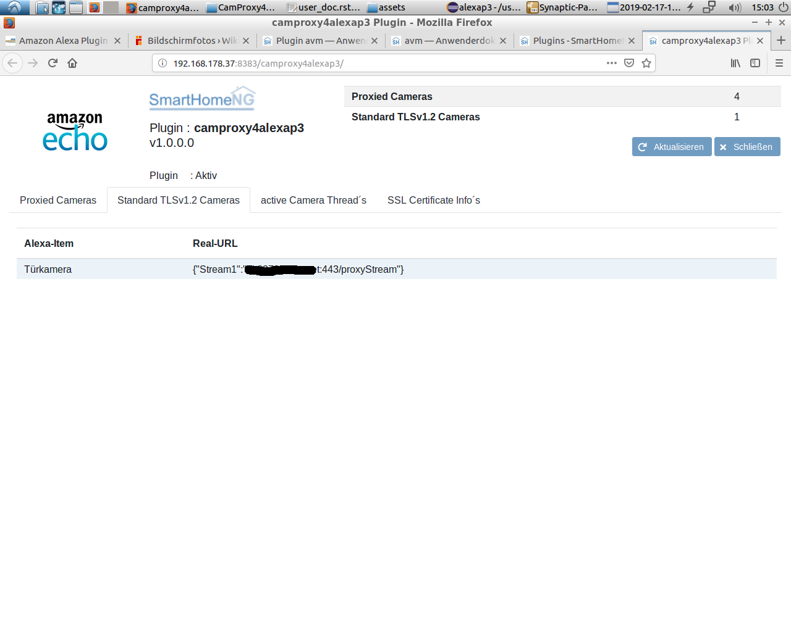
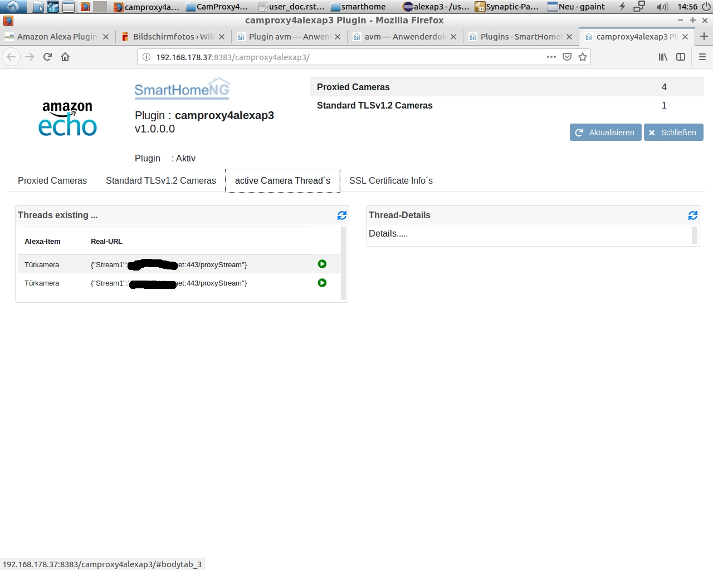
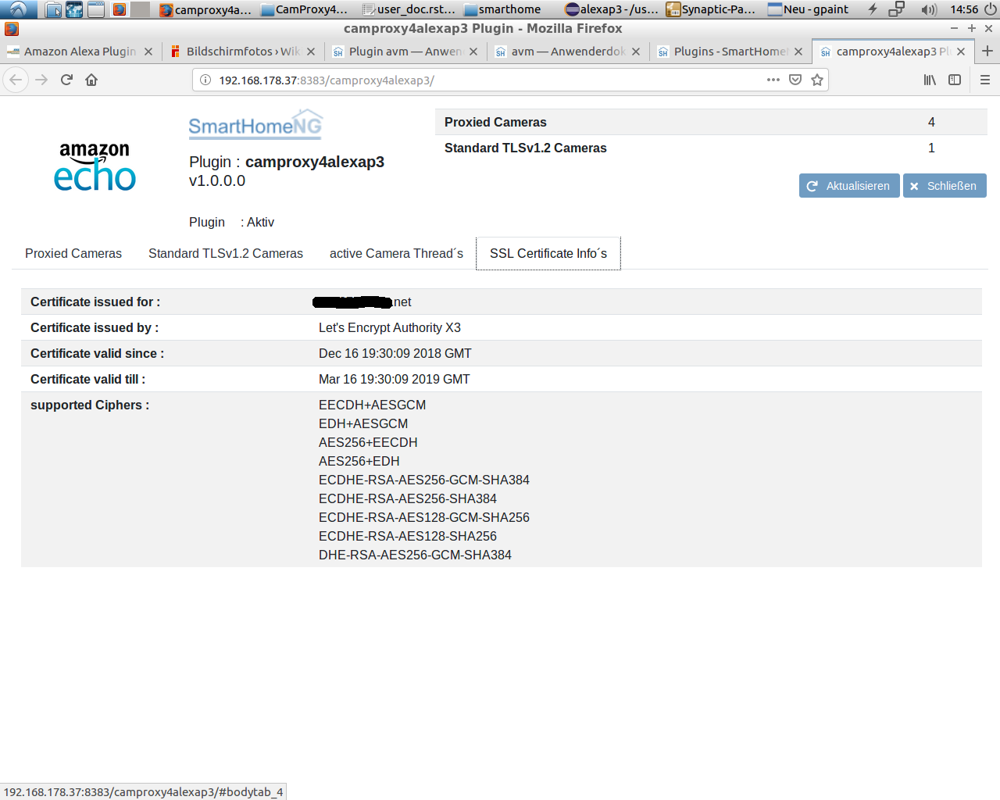

.. index:: Plugins; CameraProxy for Alexa devices with screen
.. index:: CamProxy4AlexaP3

CamProxy4AlexaP3
###

Konfiguration
=============

Die Informationen zur Konfiguration des Plugins sind unter :doc:`/plugins_doc/config/camproxy4alexap3` beschrieben.

Web Interface
=============

Das CamProxy4AlexaP3 Plugin verfügt über ein Webinterface.Hier können Informationen zu aktuellen Streams, verbundenen
Clients, aktiven Threads, zum SSL-Zertifikat überwacht werden. Es werden eine Historie mit gestreamten Sitzungen sowie 
Informationen zu den letzten Sitzungen bereitgestellt.

.. important:: 

   Das Webinterface des Plugins kann mit SmartHomeNG v1.4.2 und davor **nicht** genutzt werden.
   Es wird dann nicht geladen. Diese Einschränkung gilt nur für das Webinterface. Ansonsten gilt 
   für das Plugin die in den Metadaten angegebene minimale SmartHomeNG Version.

Aufruf des Webinterfaces
------------------------

Das Plugin kann aus dem backend aufgerufen werden. Dazu auf der Seite Plugins in der entsprechenden
Zeile das Icon in der Spalte **Web Interface** anklicken.

Außerdem kann das Webinterface direkt über ``http://smarthome.local:8383/camproxy4alexap3`` aufgerufen werden.

Beispiele
---------

Folgende Informationen können im Webinterface angezeigt werden:

Oben rechts werden allgemeine Parameter zum Plugin angezeigt. 

Im ersten Tab werden die proxied Kameras angezeigt, die das CamProxy4AlexaP3 - Plugin nutzen:

Im zweiten Tab werden die Kameras angezeigt welche das Plugin nicht nutzen und direkt verbunden werden:

Im dritten Tab werden Informationen zu den aktuellen Threads angezeigt angezeigt:

Im vierten Tab werden Informationen zum SSL-Zertifikat angezeigt:

